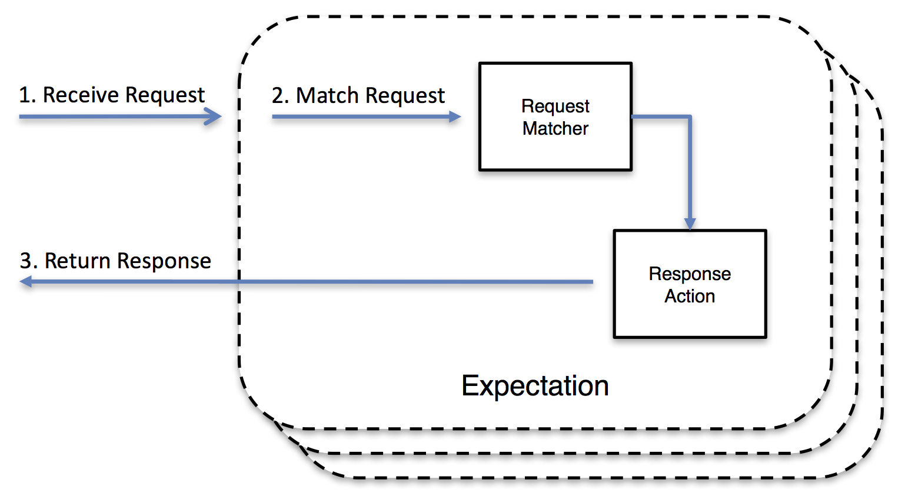
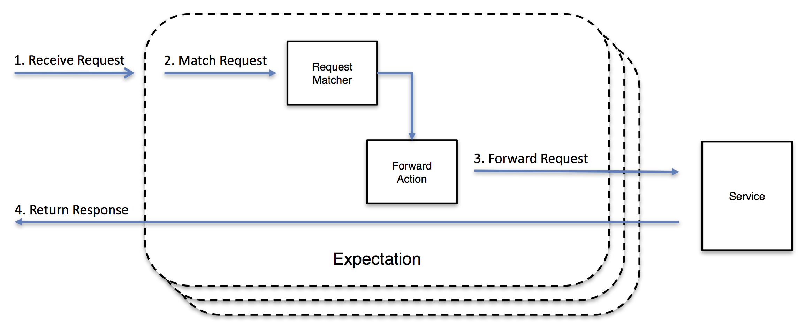
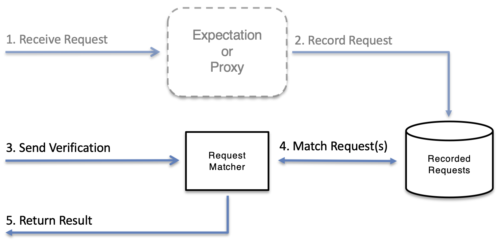
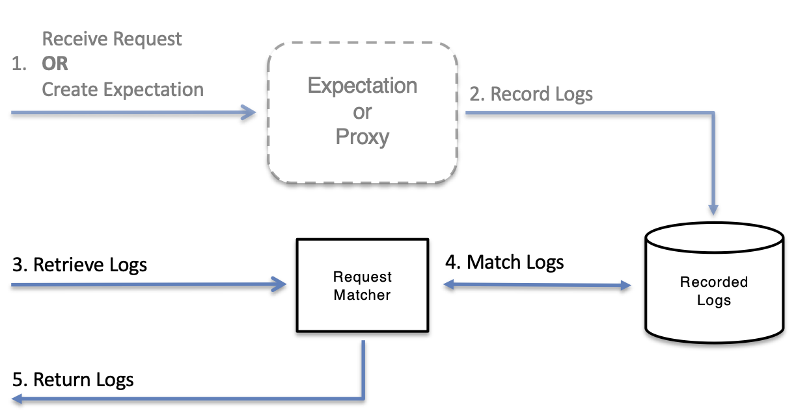
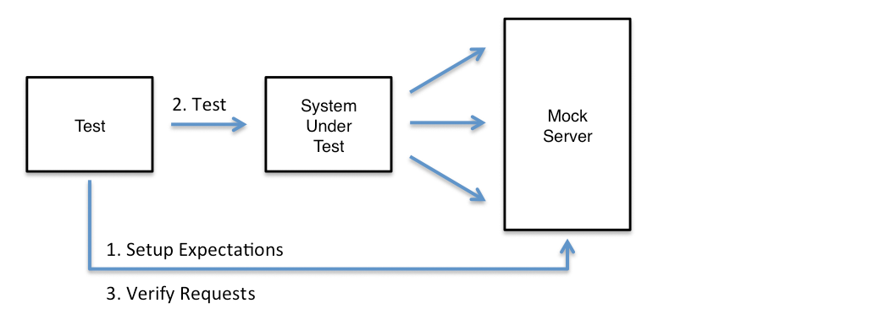
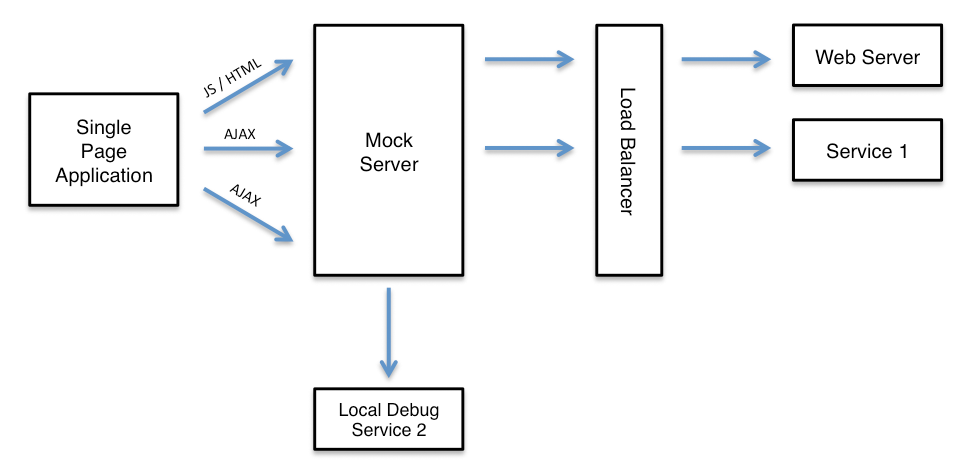

# MockServer

Easy mocking of any system you integrate with via HTTP or HTTPS

## [What is MockServer](https://www.mock-server.com/#what_is_mockserver)

For any system you integrate with via HTTP or HTTPS MockServer can be used as:

- a [mock](https://www.mock-server.com/mock_server/getting_started.html) configured to return specific responses for different requests
- a [proxy](https://www.mock-server.com/proxy/getting_started.html) recording and optionally modifying requests and responses
- both a [proxy](https://www.mock-server.com/proxy/getting_started.html) for some requests and a [mock](https://www.mock-server.com/mock_server/getting_started.html) for other requests at the same time

When MockServer receives a request it matches the request against active **expectations** that have been configured, if no matches are found it proxies the request if appropriate otherwise a 404 is returned.

For each request received the following steps happen:

1. find matching expectation and perform action
2. if no matching expectation proxy request
3. if not a proxy request return 404

An **expectation** defines the **action** that is taken, for example, a response could be returned.

MockServer supports the follow **actions**:

- return a "mock" [response](https://www.mock-server.com/mock_server/creating_expectations.html#mock_response)  when a request matches an  expectation

  

- [forward](https://www.mock-server.com/mock_server/creating_expectations.html#mock_forward) a request when the request matches an expectation (i.e. a dynamic port forwarding proxy)

  

- execute a [callback](https://www.mock-server.com/mock_server/creating_expectations.html#callback) when a request matches an expectation, allowing the response to be created dynamically

  

- return an [invalid response](https://www.mock-server.com/mock_server/creating_expectations.html#mock_error) or close the connection when a request matches an expectation

  

- [verify](https://www.mock-server.com/mock_server/verification.html) requests have been sent (i.e. as a test assertion)

  

- [retrieve](https://www.mock-server.com/mock_server/verification.html) logs, requests or expectations to help debug

  

## [Proxying with MockServer](https://www.mock-server.com/#proxying_with_mockserver)

MockServer can:

- [proxy](https://www.mock-server.com/proxy/getting_started.html) all requests using any of the following proxying methods:
- Port Forwarding
  - Web Proxying (i.e. HTTP proxy)
- HTTPS Tunneling Proxying (using HTTP CONNECT)
  - SOCKS Proxying (i.e. dynamic port forwarding)

- **[verify](https://www.mock-server.com/proxy/verification.html) proxied requests** have been sent (i.e. in a test assertion)

- **[record](https://www.mock-server.com/proxy/record_and_replay.html) proxied requests and responses** to analyse how a system behaves

MockServer supports the following proxying techniques:

- Port Forwarding

  - all requests are forwarded to a single hostname or IP and port
  - to proxy requests the **HTTP client** should [use the hostname and port of MockServer](https://www.mock-server.com/proxy/configuring_sut.html)

- Web Proxying (i.e. HTTP proxy)

  - each request is forwarded dynamically using its Host header
  - to proxy requests the **HTTP client** should [be configured to use an HTTP Proxy](https://www.mock-server.com/proxy/configuring_sut.html)

- Secure Web Proxying (i.e. HTTPS tunneling proxying)

  - requests are forwarded using a CONNECT request that setups an HTTP tunnel
  - an SSL certificate is auto-generated allowing encrypted HTTPS traffic to be recorded transparently
  - to proxy requests the **HTTP client** should [be configured to use an HTTP Proxy](https://www.mock-server.com/proxy/configuring_sut.html)

- SOCKS Proxying (i.e. dynamic port forwarding)

  - requests are forwarded using a SOCK CONNECT CMD request that established a socket tunnel
  - if the traffic is encrypted an SSL certificate is auto-generated allowing SSL traffic to be recorded transparently
  - to proxy requests the **operating system (or JVM)** should [be configured to use an HTTP Proxy](https://www.mock-server.com/proxy/configuring_sut.html)

- SSL & Certificates

  - all SSL traffic is handled transparently by auto-generating an appropriate SSL certificate
  - generated certificates use a single [MockServer root CA certificate](https://github.com/mock-server/mockserver/blob/master/mockserver-core/src/main/resources/org/mockserver/socket/CertificateAuthorityCertificate.pem) enabling the root certificate to be [easily imported](https://www.mock-server.com/mock_server/HTTPS_TLS.html)

- Port Unification

  - to simplify configuration all protocols (i.e. HTTP, HTTPS / TLS, SOCKS, etc) are supported on the same port
  - the protocol is dynamically detected by both MockServer

- Simultaneous Proxying & Mocking

  - if MockServer is being used as a proxy **expectations** can also be created
  - when a request is received it is first matched against active **expectations** that have been configured
  - if an **expectations** is matched its **action** will be performed instead of proxying the request

## [Why use MockServer](https://www.mock-server.com/#why-use-mockserver)

MockServer allows you to mock any server or service via HTTP or HTTPS, such as a REST or RPC service.

This is useful in the following scenarios:

- testing
  - easily recreate all types of responses for HTTP dependencies such as REST or RPC services to test applications easily and affectively
  - isolate the system-under-test to ensure tests run reliably and only fail when there is a genuine bug. It is important only the system-under-test is tested and not its dependencies to avoid tests failing due to irrelevant external changes such as network failure or a server being rebooted / redeployed.
  - easily setup mock responses independently for each test to ensure test data is encapsulated with each test. Avoid sharing data between tests that is difficult to manage and maintain and risks tests infecting each other
  - create test assertions that verify the requests the system-under-test has sent
- de-coupling development
  - start working against a service API before the service is available. If an API or service is not yet fully developed MockServer can mock the API allowing any team who is using the service to start work without being delayed
  - isolate development teams during the initial development phases when the APIs / services may be extremely unstable and volatile. Using MockServer allows development work to continue even when an external service fails
- isolate single service
  - during deployment and debugging it is helpful to run a single application or service or handle a sub-set of requests on on a local machine in debug mode. Using MockServer it is easy to [selectively forward requests to a local process](https://www.mock-server.com/mock_server/isolating_single_service.html) running in debug mode, all other request can be forwarded to the real services for example running in a QA or UAT environment

### **Mocking Dependencies & Verifying Request**

Given a system with service dependencies, as follows:

MockServer could be used to mock the service dependencies, as follows:

### **Isolating Single Service / Application**

A single page application may load static resources such as HTML, CSS and JavaScript from a web server and also make AJAX calls to one or more separate services, as follows:

To isolate a single AJAX service, for development or debugging, the MockServer can selectively forward specific requests to local instance of the service:

Using MockServer as a content routing load balancer is described in more detail in the section called [Isolate Single Service](https://www.mock-server.com/mock_server/isolating_single_service.html).

## Why use MockServer as a proxy

MockServer allows you to record request from the system-under-test or two analysis an existing system by recording outbound requests.

This is useful in the following scenarios:

- testing
  - create test assertions that verify the requests the system-under-test has been sent, without needing to mock any requests
- analyse existing system
  - record all outbound requests so it is possible to analise and under stand what outbound requests an existing system is making
- debug HTTP interactions
  - log all outbound requests so it is possible to visualise all interactions (for example from a browser) to external services. This is particularly important as network analysis tools in browsers such as Chrome do not accurately show all network interactions, such as, favicon.ico requests. In addition, many proxies do not handle encrypted HTTPS traffic, however, MockServer auto-generates certificates using a single [MockServer root CA certificate](https://github.com/mock-server/mockserver/blob/master/mockserver-core/src/main/resources/org/mockserver/socket/CertificateAuthorityCertificate.pem) enabling the root certificate to be [easily imported](https://www.mock-server.com/mock_server/HTTPS_TLS.html)
- record & replay
  - all recorded requests can be converted into Java code or JSON expectations to simplify the creation of mocks for complex test scenarios

### **Recording Requests & Analysing Behaviour**

MockServer can record all proxied requests, as follows:

### **Verifying Request**

MockServer can verify proxied service requests, as follows:

> https://www.mock-server.com/#what-is-mockserver