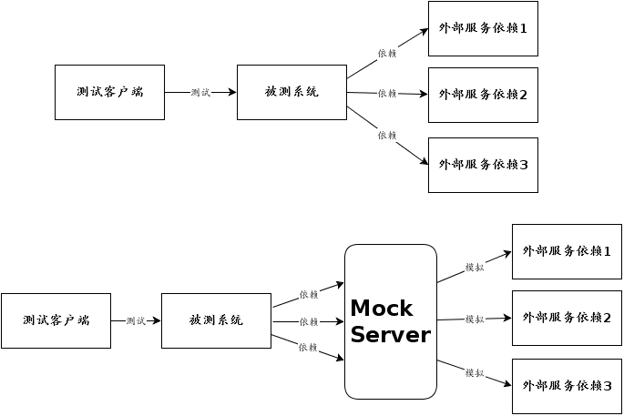
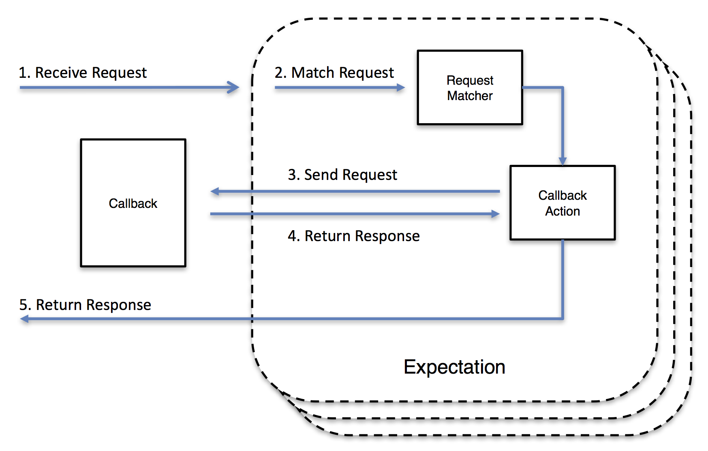
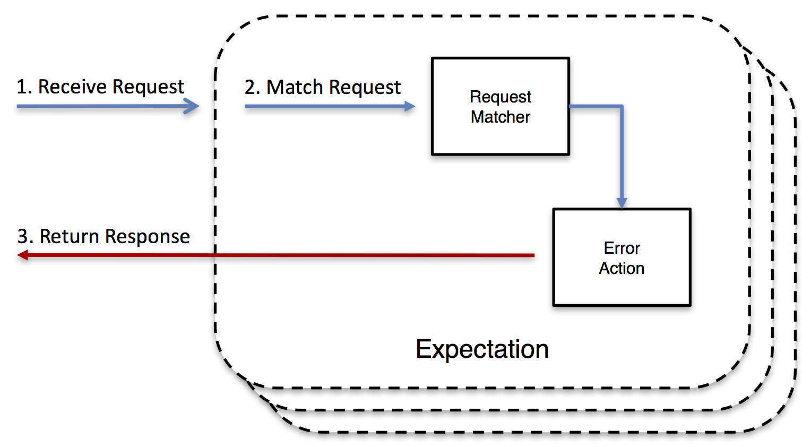

## MockServer简介

服务端测试中，被测服务通常依赖于一系列的外部模块，被测服务与外部模块间通过REST API调用来进行通信。要对被测服务进行系统测试，一般做法是，部署好所有外部依赖模块，由被测服务直接调用。然而有时被调用模块尚未开发完成，或者调用返回不好构造，这将影响被测系统的测试进度。为此我们需要开发桩模块，用来模拟被调用模块的行为。最简单的方式是，对于每个外部模块依赖，都创建一套桩模块。然而这样的话，桩模块服务将非常零散，不便于管理。Mock Server为解决这些问题而生，其提供配置request及相应response方式来实现通用桩服务。本文将专门针对REST API来进行介绍Mock Server的整体结构及应用案例。

  


### MockServer支持能力

#### 1. 返回“模拟”响应

  

#### 2. 执行回调，动态创建响应

  

#### 3. 返回异常或无效响应

  


<!-- more -->

## MockServer支持匹配规则

### 请求**属性匹配器**使用以下一个或多个属性匹配请求：

- **method**-[属性匹配器](https://www.mock-server.com/mock_server/creating_expectations.html#request_property_matchers)
- **path**-[属性匹配器](https://www.mock-server.com/mock_server/creating_expectations.html#request_property_matchers)
- **path parameters**-[多个值匹配器的键](https://www.mock-server.com/mock_server/creating_expectations.html#request_key_to_multivalue_matchers)
- **query string parameters**-[多个值匹配器的键](https://www.mock-server.com/mock_server/creating_expectations.html#request_key_to_multivalue_matchers)
- **headers**-[多个值匹配器的键](https://www.mock-server.com/mock_server/creating_expectations.html#request_key_to_multivalue_matchers)
- **cookies**-[单个值匹配器的关键](https://www.mock-server.com/mock_server/creating_expectations.html#request_key_to_value_matchers)
- **body**-[请求体匹配器](https://www.mock-server.com/mock_server/creating_expectations.html#request_body_matchers)
- **secure**- 布尔值，为 true 时 使用 HTTPS。


### [属性**匹配**](https://www.mock-server.com/mock_server/creating_expectations.html#request_property_matchers)可以使用：

- 字符串值
  - **用于：方法**、路径、路径参数键、路径参数值、查询参数键、查询参数值、标头键、标头值、Cookie 键、Cookie 值或实体
  - **示例：**[方法](https://www.mock-server.com/mock_server/creating_expectations.html#button_match_request_by_query_parameter_name_regex)[、路径](https://www.mock-server.com/mock_server/creating_expectations.html#button_match_request_by_path)[、路径参数](https://www.mock-server.com/mock_server/creating_expectations.html#button_match_request_by_path_and_path_parameters)[、查询](https://www.mock-server.com/mock_server/creating_expectations.html#button_match_request_by_cookies_and_query_parameters)参数[、标头](https://www.mock-server.com/mock_server/creating_expectations.html#button_match_request_by_headers)[、cookie](https://www.mock-server.com/mock_server/creating_expectations.html#button_match_request_by_cookies_and_query_parameters)
- 正则表达式值
  - **用于：方法**、路径、路径参数键、路径参数值、查询参数键、查询参数值、标头键、标头值、Cookie 键、Cookie 值或实体
  - **示例：**[方法](https://www.mock-server.com/mock_server/creating_expectations.html#button_match_request_by_method_regex)[、路径](https://www.mock-server.com/mock_server/creating_expectations.html#button_match_request_by_regex_path)[、路径](https://www.mock-server.com/mock_server/creating_expectations.html#button_match_request_by_path_parameter_regex_value)参数[、查询](https://www.mock-server.com/mock_server/creating_expectations.html#button_match_request_by_query_parameter_name_regex)[参数、标头](https://www.mock-server.com/mock_server/creating_expectations.html#button_match_request_by_header_name_regex)
  - 有关语法，请参阅[Java 正则表达式语法](https://docs.oracle.com/javase/8/docs/api/java/util/regex/Pattern.html)
- json schema
  - **用于：方法**、路径、路径参数值、查询参数值、标头值、Cookie 值或实体
  - **不支持：路径参数**键、查询参数键、标头键或 Cookie 键
  - **示例：**[路径参数](https://www.mock-server.com/mock_server/creating_expectations.html#button_match_request_by_path_parameter_json_schema_value)[、查询参数](https://www.mock-server.com/mock_server/creating_expectations.html#button_match_request_by_query_parameter_value_json_schema)[、标头](https://www.mock-server.com/mock_server/creating_expectations.html#button_match_request_by_header_value_json_schema)[、cookie](https://www.mock-server.com/mock_server/creating_expectations.html#button_match_request_by_cookies_value_json_schema)
  - 有关语法，[请参阅JSON Schema文档](https://json-schema.org/)
- 可选值
  - **用于： 方法**、路径、路径参数值、查询参数键、查询参数值、标头键、标头值、Cookie 键、Cookie 值或实体
  - **不支持：路径参数**键或值、查询参数值、标头值或 Cookie 值
  - **示例：**[查询参数](https://www.mock-server.com/mock_server/creating_expectations.html#button_match_request_by_optional_query_parameter)[、标头](https://www.mock-server.com/mock_server/creating_expectations.html#button_match_request_by_optional_header)[、cookie](https://www.mock-server.com/mock_server/creating_expectations.html#button_match_request_by_optional_cookies)
- 否定值
  - **用于：方法**、路径、路径参数键、路径参数值、查询参数键、查询参数值、标头键、标头值、Cookie 键、Cookie 值或实体
  - **示例：**[方法](https://www.mock-server.com/mock_server/creating_expectations.html#button_match_request_by_not_matching_method)[、](https://www.mock-server.com/mock_server/creating_expectations.html#button_match_request_by_not_matching_path)路径[、标头](https://www.mock-server.com/mock_server/creating_expectations.html#button_match_request_by_not_matching_header_value)


[匹配多个**值的键支持**](https://www.mock-server.com/mock_server/creating_expectations.html#request_key_to_multivalue_matchers)标头、查询参数和路径参数的每个键的多个值

- 键支持除 json[架构之外](https://www.mock-server.com/mock_server/creating_expectations.html#request_property_matchers)的所有属性匹配器
- 值支持除[可选值之外](https://www.mock-server.com/mock_server/creating_expectations.html#request_property_matchers)的所有属性匹配器
- 匹配支持两种模式：
  - **[子集](https://www.mock-server.com/mock_server/creating_expectations.html#button_match_request_by_query_parameter_by_sub_set)**（默认） - 如果请求属性包含匹配的子集（考虑可选键），则匹配，因此**每个**非可选键或可选键至少有一个匹配值（如果存在
  - **[匹配键](https://www.mock-server.com/mock_server/creating_expectations.html#button_match_request_by_header_by_matching_key)**- 如果请求属性仅包含匹配值（考虑可选键），则匹配**键，因此所有值必须匹配**每个非可选键或可选键（如果存在）


[匹配密钥**与单个值支持**](https://www.mock-server.com/mock_server/creating_expectations.html#request_key_to_value_matchers)Cookie 的每个密钥的单个值

- 键支持除 json[架构之外](https://www.mock-server.com/mock_server/creating_expectations.html#request_property_matchers)的所有属性匹配器
- 值支持除[可选值之外](https://www.mock-server.com/mock_server/creating_expectations.html#request_property_matchers)的所有属性匹配器


## 安装

```shell
ssh root@mockserver.zxytech.com

# 拉取镜像 docker pull mockserver/mockserver:mockserver-5.11.1
# 相对于原始镜像 开放“/config”，“/libs”两个Volume便于映射到宿主机，维护规则及自定义jar
docker pull zxytech/mockserver:5.11.1

# 直接使用host网络运行MockServer
docker run \
--network host \                                   # 使用宿主机网络
-u root:root \                                     # 使用root避免挂载文件无法在宿主机创建
-d \                                               #
-v "/home/mockserver/config":"/config" \           # 便于直接在宿主机维护配置文件
-v "/home/mockserver/libs":"/libs" \               # 便于在宿主机维护自定义jar
-v "/etc/localtime":"/etc/localtime" \             # 与宿主机使用相同时区
--name mockserver \                                # 命名便于后续使用
zxytech/mockserver:5.11.1                          # 使用自定义镜像


# 查看日志
docker logs -f --tail 100 mockserver

# 更新jar包重启服务
scp common-1.0-SNAPSHOT.jar mockserver.zxytech.com:/home/mockserver/libs 

docker restart mockserver
```


### 配置开机启动

#### 1. 添加文件 `/etc/rc.d/init.d/mockserver`

```bash
#!/bin/bash
#
# mockserver
# chkconfig: 2345 80 90
# description: start mockserver docker
# config: /home/mockserver/config/mockserver.properties
#
# Copyright 2002 Red Hat, Inc.
#
# Based in part on a shell script by
# Andreas Dilger <adilger@turbolinux.com>  Sep 26, 2001

PATH=/sbin:/usr/sbin:$PATH
RETVAL=0


usage ()
{
	echo $"Usage: $0 {start|stop|status|restart}" 1>&2
	RETVAL=2
}

start ()
{
	docker start mockserver
}

stop ()
{
	docker stop mockserver
}

status ()
{
	docker ps
}


restart ()
{
	docker restart mockserver
}


case "$1" in
    stop) stop ;;
    status) status ;;
    start|restart|reload|force-reload) restart ;;
    *) usage ;;
esac

exit $RETVAL
```

#### 2. 添加到开机启动

```shell
chmod +x /etc/rc.d/init.d/mockserver
chkconfig --add mockserver
```

### 添加防火墙规则

#### 1. 添加 `/usr/lib/firewalld/services/mockserver.xml`

```xml
<?xml version="1.0" encoding="utf-8"?>
<service>
    <short>MockServer</short>
    <description>Easy mocking of any system you integrate with via HTTP or HTTPS</description>
    <port protocol="tcp" port="1080"/>
    <port protocol="udp" port="1080"/>
</service>
```

#### 2. 永久添加规则

`firewall-cmd --permanent --add-service=mockserver`


## 使用示例

### 使用REST创建

```http
PUT http://172.20.66.36:1080/mockserver/expectation HTTP/1.1
Content-Type: application/json

{
  "httpRequest" : {
    "path" : "/authentication/verify-id",
  },
  "httpResponse" : {
    "body" : {
      "code": "0000",
      "message": "操作成功"
    }
  }
}
```


### Dockerfile

```shell
docker image build -t zxytech/mockserver:5.11.1 .

docker push zxytech/mockserver
```

https://www.mock-server.com/mock_server/running_mock_server.html#docker_container

```dockerfile
#
# MockServer Dockerfile
#
# https://github.com/mock-server/mockserver
# http://www.mock-server.com
#

# build image
FROM alpine as build

# download jar
RUN apk add --update openssl ca-certificates bash wget
# REPOSITORY is releases or snapshots
ARG REPOSITORY=releases
# VERSION is LATEST or RELEASE or x.x.x
ARG VERSION=RELEASE
# see: https://oss.sonatype.org/nexus-restlet1x-plugin/default/docs/path__artifact_maven_redirect.html
ARG REPOSITORY_URL=https://oss.sonatype.org/service/local/artifact/maven/redirect?r=${REPOSITORY}&g=org.mock-server&a=mockserver-netty&c=jar-with-dependencies&e=jar&v=${VERSION}
RUN wget --max-redirect=10 -O mockserver-netty-jar-with-dependencies.jar "$REPOSITORY_URL"

# runtime image
FROM gcr.io/distroless/java:11

# maintainer details
LABEL MAINTAINER.NAME="James Bloom" MAINTAINER.EMAIL="jamesdbloom@gmail.com"

# expose ports.
EXPOSE 1080

# copy in jar
COPY --from=build mockserver-netty-jar-with-dependencies.jar /

# don't run MockServer as root
USER nonroot

VOLUME [ "/config", "/libs", "/etc/localtime" ]

ENTRYPOINT ["java", "-Duser.timezone=Asia/Shanghai", "-Dfile.encoding=UTF-8", "-cp", "/mockserver-netty-jar-with-dependencies.jar:/libs/*", "-Dmockserver.propertyFile=/config/mockserver.properties", "org.mockserver.cli.Main"]

CMD ["-serverPort", "1080"]
```


## 使用示例

### 使用REST创建

```http
PUT http://mockserver.zxytech.com:1080/mockserver/expectation HTTP/1.1
Content-Type: application/json

{
  "httpRequest" : {
    "path" : "/authentication/verify-id",
  },
  "httpResponse" : {
    "body" : {
      "code": "0000",
      "message": "操作成功"
    }
  }
}
```


### 在rdm-automation中使用

```java
    @Test(description = "云账户接口mock")
    public void testMockYunzhanghuWxpay() {
        new MockServerClient("mockserver.zxytech.com", 1080)
            .clear(
                request()
                    .withPath("/authentication/verify-id")
            );

        new MockServerClient("mockserver.zxytech.com", 1080)
            .when(
                request()
                    .withPath("/authentication/verify-id")
            )
            .respond(
                HttpResponse.response()
                    .withBody(JsonBody.json("{\"code\":\"0000\",\"message\":\"操作成功\"}"))
            );

        new MockServerClient("mockserver.zxytech.com", 1080)
            .clear(
                request()
                    .withPath(MockOrderWxpayCallback.MOCK_URL_PATH)
            );

        new MockServerClient("mockserver.zxytech.com", 1080)
            .when(
                request()
                    .withPath(MockOrderWxpayCallback.MOCK_URL_PATH)
            )
            .respond(
                HttpClassCallback.callback()
                    .withCallbackClass(MockOrderWxpayCallback.class)
            );

    }
```


**MockOrderWxpayCallback**

```java
public class MockOrderWxpayCallback implements ExpectationResponseCallback {

    public static final String MOCK_URL_PATH = "/api/payment/v1/order-wxpay";

    private static void asyncCallback(OrderResp orderResp) {
        orderResp.setStatus(Status.PROCESSED.getCode());
        orderResp.setStatusMessage(Status.PROCESSED.getDescribe());
        orderResp.setFinishedTime(String.valueOf(System.currentTimeMillis()));

        new Scheduler(new MockServerLogger()).schedule(() -> {
            Map<String, Object> resp = new HashMap<>(6);
            resp.put("mess", RandomStringUtils.randomNumeric(10));
            resp.put("timestamp", System.currentTimeMillis() / 1000);
            try {
                resp.put("data", encrypt(JSONObject.toJSONString(orderResp)));
                resp.put("sign", sign(resp));
            } catch (Exception e) {
                post("http://mockserver.zxytech.com:1080/withdraw/yunzhanghu/callback",
                    e.getMessage());
            }
           post(orderResp.getNotifyUrl(), JSONObject.toJSONString(resp));
           
        }, false, Delay.seconds(1));
    }

    @Override
    public HttpResponse handle(HttpRequest httpRequest) throws Exception {
        String reqData = urldecode(httpRequest.getBodyAsString()).get("data").toString();
        String reqStr = decrypt(reqData);

        OrderResp orderResp = JSONObject.parseObject(reqStr, OrderResp.class);
        orderResp.setRef(RandomStringUtils.randomNumeric(20));
        orderResp.setStatusDetail(StatusDetail.SUCCEED.getCode());
        orderResp.setStatusDetailMessage(StatusDetail.SUCCEED.getDescribe());

        asyncCallback(SerializationUtils.clone(orderResp));

        orderResp.setStatus(Status.APPLIED.getCode());
        orderResp.setStatusMessage(Status.APPLIED.getDescribe());
        Map<String, Object> resp = new HashMap<>(3);
        resp.put("code", "0000");
        resp.put("message", "操作成功");
        resp.put("data", orderResp);
        return HttpResponse.response().withBody(new JsonBody(JSONObject.toJSONString(resp)));
    }

}
```


## 参考文档

> https://www.mock-server.com/mock_server/creating_expectations.html
>
> https://www.mock-server.com/mock_server/getting_started.html
>
> https://www.mock-server.com/mock_server/running_mock_server.html#docker_container
>
> https://www.mock-server.com/mock_server/configuration_properties.html
>
> https://www.mock-server.com/#what-is-mockserver
>
> https://www.mock-server.com/#why-use-mockserver
>
> https://www.mock-server.com/mock_server/mockserver_clients.html
>
> https://tech.meituan.com/2015/10/19/mock-server-in-action.html