# 思维混乱，是因为大脑没有结构

请你花10秒钟的时间，记住以下的20个数字：

好，我们再来试一组数字，还是花10秒钟来记住它：

其实这2组的20个数字是一样的，但是不是觉得第二组一下子就记住了？

<!-- more -->

## 为什么会这样？

因为第二组数据更符合我们大脑的使用习惯，数字与数字之间有清晰的逻辑和结构。

我们大脑处理信息有2个规律：

- 太多的信息记不住
- 喜欢有规律的信息

可你有没有遇到过这样的情况：有人口若悬河的和你讲了半天，他说的每个字你都听得懂，然而组合在一起，你并不知道他想说什么，内容没有逻辑，语句没有重点，就像刚才那一串杂乱的数字...

听他说话时间一长，你甚至开始头疼，变得焦躁，心里骂到：“你TM到底想说什么...？”

你别觉得听着难受，讲的人，他自己也许更难受！

明明心里有很多想法，甚至做了上百页的PPT，但就是讲不清楚….为什么会这样？

## 因为思维没有结构

我们思考问题的时候，脑子里的想法会不断地涌现出来，看似有很多，却杂乱无章，就像是衣橱里的一堆没有整理的衣服，彼此缠绕，互相堆砌在一起。

当有人问你，你能说说你有哪些衣服吗？

“嗯....我有很多衣服（想法）...”

## 能详细点说吗？

“我有一条蓝裤子，一条橘黄色裙子，一件白衬衫，还有件灰白条纹衬衫，一条牛仔裤，一条蓝色竖条纹的裤子，还有顶黑色的帽子，哦对了，还有一条蓝色裤子（这个刚才好像说过了)…”

￥#%@#￥%@… 你到底有些啥？

“我刚才说的都是我有的啊…”

语言是思维的传声筒

如果你的思维没有经过整理，就会像这堆乱糟糟的衣服，你拥有他们，却无法理解他们！

自己看着难受，别人听着难懂！

那怎么办？如何让思维变得既全面又有序呢？

## 你需要结构化思维

所谓结构化思维，就像是把衣橱里的这些衣服，分门别类的整理好。

比如按季节分类，按穿着场合分类，按服装风格分类等等..

这时候，别人再问你：你有些什么衣服呢？

你回答：我一共有208件装备，分为：

- 夏季、春秋季、冬季三大类；
- 每个季节的衣服又分为工作装、休闲装、宴会装、运动装四大系列；
- 其中，休闲装里有田园、淑女、简约三种风格；
- 每种风格的衣服，拥有深色、浅色各3套搭配；
- 另外配了4双运动鞋，5双皮鞋，6双休闲鞋，7个包包，8顶帽子来应对不同需要..

是不是听着清楚多了？

并且，当你需要使用这些整理好的衣服时，也会变得很方便。

比如，今天你想要和男朋友晚上去一个party，那么你不需要再从所有的衣服里翻来覆去的寻找，一件件试穿...

而是直接在已经分类好的衣橱中，找到宴会装区域，从里面拿起一套适合的即可。

把你的想法和思维内容，像整理衣服一样，分门别类的安放好，组成一个结构分明的整体，方便日后的理解、存储、使用。这个，就称之为「结构化思维」

## 学会结构化的思维，有什么好处？

如果你能够习惯用结构化的方式进行思考，你的思维能力，沟通能力，学习能力都将获得大幅度的提升：

比如，公司的线下门店，生意突然下滑，怎么办？

如果你不会结构化思维，你可能会这样说...

思路清晰，考虑周全。

再比如，你们公司近期要举办一场大型的相亲活动，你是项目的负责人，目前正在召开项目工作会议，老板请你介绍一下本次活动目前的安排：

如果你不会结构化思维，你可能会这样表达...

是不是感觉整个表达逻辑非常的有序，层次分明？

除了表达和思考，结构化的能力还能帮助我们提高学习的效率，比如我问你：过去一年，你都学了些啥呢？

如果你不会结构化思维，你可能会这样回答...

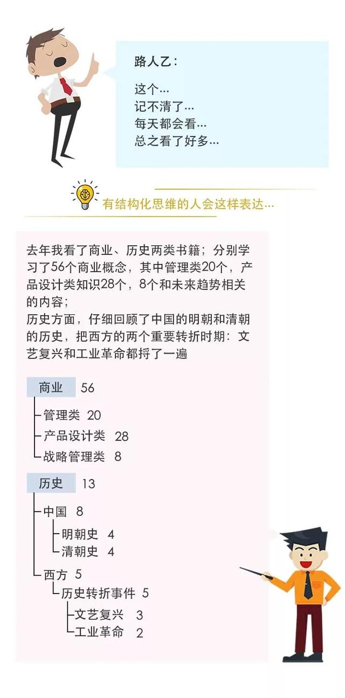

怎么样？是不是感觉很不一样呢？

好，说了那么多结构化思维的好处，那么，我们应该如何才能拥有这种能力呢？

接下来，我就带你从最基本的地方开始说起，帮助你快速学会结构化思维。

## 快速学会结构化思维

有一天，你驾驶着自己的汽车，在路上游荡，汽车突然停下，发生哄哄的巨响，无法行驶，怎么办？

是哪里出了问题？轮胎？轴承？发动机？油箱？还是有只猫在车里作怪？

一辆汽车，拥有上万个零件，当你发现汽车的行驶功能出现故障时，如果你不是专业修汽车的，你根本不知道是哪个零件可能出了问题，你能想到的也是这上万零件里的一小部分...

### 那怎么办？

你一通乱试后，最终无果，只得叫来拖车，将汽车送入了修理厂...

师傅一看，说：小问题，你稍等片刻…

然后咔咔咔，不到一局王者荣耀的时间，就把车给修好了！

为什么能那么快？

不是有上万个零件吗？

如果逐个检查一遍，至少也需要一天的时间啊，这还不算更换和维修的时间！

师傅为什么能那么快？

因为：结构！

在维修师傅的眼中，汽车并不是由上万个零件拼接而成的，而是「结构化」的：

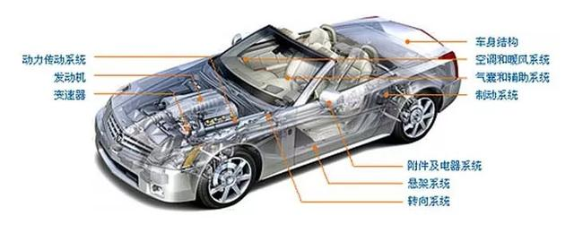

- 有了结构，师傅就能由局部到整体，快速判断可能导致问题的所有区域。
- 有了结构，师傅就能由混乱到有序，以模块为单位进行整块整组的排查。
- 有了结构，师傅就能由复杂到简单，将大问题切成多个小问题逐个击破。

透过结构看世界，你就拥有了化繁为简的能力！

结构化思维，关键就在于「结构」二字，如果你能找到复杂问题背后的结构，就能像修车师傅那样，将问题化繁为简，变成若干个小问题，从而更快速的找到解决方案。

那么，我们该如何将一个问题结构化呢？

## 结构化思考的步骤

### 第一步 明确目的，找到分解角度

所谓的结构化，是不是就是把问题拆散、切碎，然后再分类汇总就行了？

比如刚才整理衣服的的例子、汽车零件的例子，就是把一个整体，拆分成一个个小零件，然后根据小零件的属性，进行了分类汇总。

真的是这样吗？

并没有那么简单...

将一个「整体」拆成一个个独立的「要素」，再将一个个「要素」组合成的结构，其实可以有很多种组合方式。

比如刚才的汽车零件，你也可以把它们按材质分类，方便垃圾回收；

或者按生产零件的厂家分类，方便返厂维修；

或者按头部、身体、四肢的构造分类，就能组合成一个大黄蜂….

同样的要素，组合成不同的结构，就能实现不同的功能和目的。因此，结构化思维，并不是简单的做个分类汇总，而是分解后，以什么方式组合，要达成什么目的？

所以，我们得在问题分解之前，先弄清楚分解的目的是什么，然后根据目的进行拆解与结构化。比如说，对于一个项目：

- 如果目标是分析进度：那就按时间进度，过程阶段来分解；
- 如果目标是分析成本：那就按工作项来分解；
- 如果目标是分析客户：那就按性别、年龄、学历、职业、收入等来分解。

### 第二步 按MECE原则，组成结构

确定了分解目的，然后我们就要开始搭建结构了，先说一种最基本的结构形态：金字塔结构。

#### 什么是金字塔结构？

简单来说就是：先确认目标问题，再根据分解的目的，将问题分解成不同的类别，类别下再放入对应的不同要素，这样逐层分解，最终的形成类似于金字塔的形状结构。

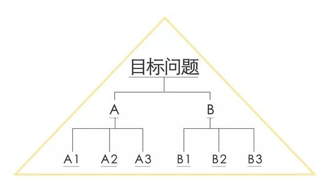

并且，金字塔的每一层，都必须牢固，不能少一块砖，也不能多一块砖，不然整个结构就会垮塌，这个就称为MECE原则。

#### 什么是MECE原则？

MECE是麦肯锡著名咨询师「巴巴拉·明托」在她的著作《金字塔原理》中提出的核心概念，意思是：相互独立、完全穷尽。

也就是金字塔的每一层，内容不能有重复的部分，也不能有遗漏的部分。

比如，你把衣服分类为：

- 春秋季服饰
- 职业套装

这个就有重叠的部分：有些衣服既是职业装，也是春秋季服饰；

也有遗漏的部分：夏天穿的休闲服应该归到哪一类？

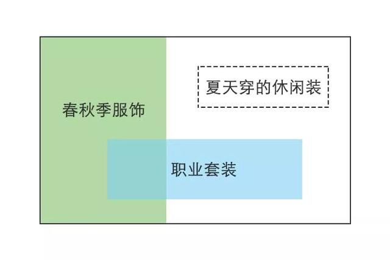

那么，什么才是不重叠，不遗漏，符合MECE原则的呢？

你可以按季节分：春秋装，冬装，夏装。

除了这3类之外，没有其他季节了，这个就是「不遗漏」；春秋的衣服差不多，所以归为一类，夏天的衣服，春秋冬穿不了；冬天的衣服，也不能归类在春夏秋这三个季节里，因此「不重叠」，符合MECE原则。

是不是有点听晕了？

不着急，下面我用一个例子来说明：

问题：如何在未来三个月完成100万销售业绩？

我们可以通过以下两种方式来构建金字塔结构：

#### 方式 1自上而下「使用演绎法」设计结构。

要完成100万的业绩，关键是客户，因此我们可以根据客户的类别进行划分，对不同客户类别采取不同的营销策略来完成业绩。

根据MECE原则我们发现，客户无非来源于三类：

- 陌生的新客户；
- 正在跟进中的准客户；
- 已经购买过的老客户；

因此，我们可以在金字塔的第一层，划分为：新客户、跟进中的客户、老客户这三类。

这样一划分，大致的思路已经清楚了：

- 开拓更多获取新客户的渠道；
- 提高跟进中客户的付款转化率；
- 促进老客户的复购；

根据这个策略，我们再继续往每个子分类中添加要素，比如：

- 在新客户下，添加可拓展的新渠道列表；
- 在准客户下，添加促销方案；
- 在老客户下，添加老客户回访计划等等...

如此这般，一层层演化细分，最终形成一个金字塔结构。

其中，第一层的分类最重要，它决定了你整个结构的整体功能。

不过，这个分解方式没有标准答案，你在运用的过程中，得根据实际问题，找到对问题的解决最直接有效切分方式，比如：

- 侧重于分而治之的
- 可以按空间维度进行分类：新客户、跟进中客户、老客户；或者业务A、业务B、业务C；
- 侧重于进度把控的
- 可以按时间维度进行分类：第一个月、第二个月、第三个月；
- 侧重于战略聚焦的
- 可以按重要程度进行分类：机构客户、普通客户；
- 侧重于目标达成的
- 可以按演绎逻辑进行分类：流量、转化率、客单价、复购率；

#### 方式 2自下而上「使用归纳法」提炼结构。

自上而下演绎法的好处是效率高，可以很快速的就把问题结构化。

可是，这种方式有个前提，就是你得对问题的解决方法有深刻的理解，能够快速找到恰当的分解角度，或者大脑中已经有了现成的结构可以直接使用，比如：销售额 = 流量 × 转化率 × 客单价。

如果没有现成的结构，或者找不到分解的角度怎么办？

你可以尝试使用「归纳法」自下而上的提炼结构。具体怎么做？

1. ##### 针对问题目标，穷尽所有能想到的内容

我们还是回到前面的问题：

如何在未来三个月完成100万销售业绩？

然后你需要开始头脑风暴，把能想到的所有相关信息，不管是建议方法、关键人物、还是重要事项、截止时间等等...总之，只要和问题相关，有多少写多少，完全穷尽。

你也可以找来一些帮手，把大伙儿关在会议室里一起讨论，运用群体智慧，通过各种唇枪舌战，各种奇思妙想，将想法、建议、点子铺满整个白板...

头脑风暴结束，你发现真的是说什么的都有…

不过，这都什么跟什么啊，果然是人多智商低.....

是不是看着很头大？

还是不知道接下来该怎么办...

别急，我们接着进行下一步...

2. ##### 用归纳法中的「求同、求异、剩余法」对内容进行分组

注：关于归纳法这几个方法可以回看上节课的内容。

在分组过程中，你需要对内容进行一些增减修补，比如：

- 把一些有明显上下层次关系的先连接起来，看起来比较方便；
- 把同一分组中明显缺少的项目补上，比如客户分类中缺少「老客户」这一类；
- 再把一些重复的内容删除，不恰当的内容进行修正；

经过一番调整，凌乱的内容很快被分成了5个大组：渠道、获客方法、产品活动、客户分类、沟通方式，这里的分组名称不要求太精确，因为后期可能还需要调整。

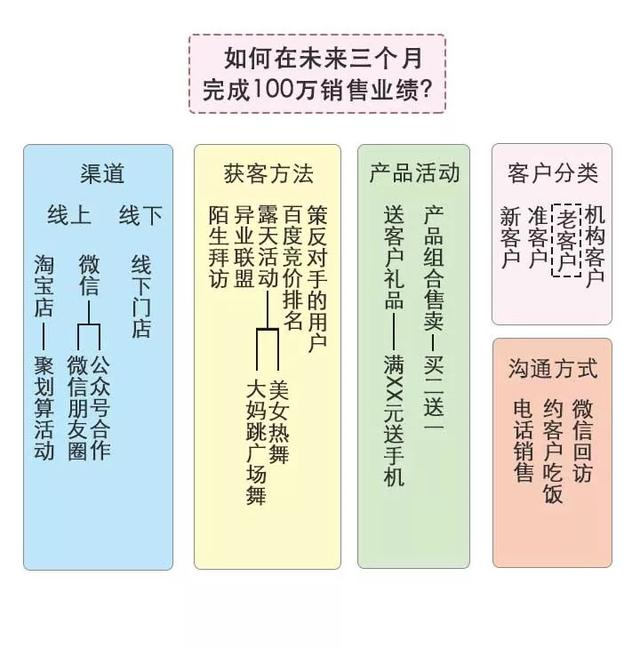

是不是感觉整体结构清晰很多了？

不过，这5类之间的逻辑，看上去还是比较混乱，内容之间也不MECE，而且也不是金字塔结构…

怎么办？

我们接着进行下一步…

3. ##### 梳理逻辑层次，构建金字塔结构

接着，你需要开始梳理这5组的逻辑关系。我们发现，「客户分类」这个组和其他几组明显不同，渠道、获客方式、沟通方式应该是根据不同的客户采取的不同的拉新、促销的手段。

因此，我们把客户分类这组拎出来，作为金字塔的上一层，把渠道、获客方法、沟通方式，根据客户的类别不同，重新组合，放在金字塔的下层。

在调整的过程中，继续修改归类错误，结构不MECE的部分，比如：

- 「客户分类」中目前的内容是：新客户，准客户，老客户，机构客户。而机构客户和其他三类有重叠部分，不符合MECE原则，应剔除；
- 之前的类别命名不精确，其实应该分为「渠道、营销」这2部分，不同的用户对应不同的渠道，不同的渠道对应不同的营销方式；
- 头脑风暴时只考虑了新客户的渠道，没有考虑准客户和老客户的渠道，要补上...

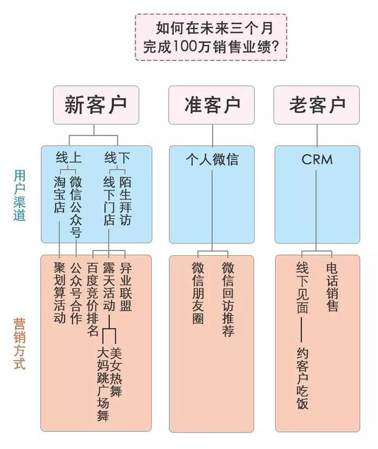

这样看上去是不是又清晰很多了？

咦？「产品活动」去哪了？

不管是新客户、准客户还是老客户，我们采取的产品活动都是同一个，因此可以把产品活动放在他们的上方，作为金字塔的顶端，这也因此成为了本次3个月业绩冲刺的核心活动。

现在是不是看到金字塔结构了？

### 第三步 调整结构，给出方案

目前这个方案看上去还不太完善。

因为内容基本都是通过头脑风暴得来的，比较零碎，但是结构已经出来了。

接下来，我们需要先检查整个结构是否MECE，逻辑层次是否有混淆的部分，调整一下。

然后，根据这个结构，再往里面继续增减要素，不断完善整个方案。

注：篇幅原因，就不再继续做深一步的完善工作了，有兴趣的同学可以自己尝试。

最后，你就可以根据这个金字塔结构，给出未来3个月业绩冲刺的完整方案了：

你看，这样一步步梳理，我们就从一堆凌乱、没有规则的想法中，提炼出了一套有结构，有逻辑，可执行的行动方案。

这，就是结构化思维的力量！

不过，结构化思维的过程，就是将问题分解成一个金字塔结构吗？

当然不是。

金字塔结构只是结构化思维中最基本的一种形态，是结构化思维的基础。

接下来，我将带你进入结构化思维的进阶技巧...

### 结构化思维的进阶技巧

通过刚才的例子我们可以看到，结构化思维，可以将一个复杂的整体，分解成多个小部分来逐个分析，让思维可以细致又不失整体；也可以将零碎的信息分类归档，组合成一个金字塔结构，让思考可以发散又井然有序。

但是，整个过程既要头脑风暴穷尽想法，又得不断调整逻辑找出恰当的结构，还需要每一层都符合MECE原则...

这样下来，耗时就会比较长。而且，万一有些该考虑的部分，因为在头脑风暴的时候没有出现，后来也没想到，导致缺少一整个思考维度，怎么办？

有没有更高效的方法，可以让你把问题快速结构化，又保证每一步都符合MECE原则呢？

下面，我就给你说一下结构化思维中的进阶技巧：平面切割法。

## 什么是平面切割法？

你拿出一张白纸放在面前，想象在白纸上即将填满的内容，将构成一个完整的方案。

然后怎么办？

念个咒语，答案就会自动出现？

当然不是。

你需要拿起一支笔，开始对这个完整的方案，用横、竖线进行切割。只要你画的线是贯穿、封闭的，那么切出来的结构一定是MECE的。

这个很好理解，因为本来就是一个整体，肯定是无遗漏的；用线条把彼此分开，一定是相互独立不重叠的。

现在的关键问题是，这个线怎么画？

当然不能随便画，就像我们中国的汉字，一共有10万个左右，每个字都不一样，但所有的汉字，都是通过「点、横、竖、撇、捺、折、弯、钩」这八个基本的笔画组合而成的。

切割平面的线也一样，也有两个基本手法，所有的结构都来源于这两个手法的单独或组合使用：

## 平面切割的基本手法：

### 1第一个画线手法：两分法

两分法是指：任何事物都是一对矛盾的统一体，彼此对立，加在一起又是一个整体。比如：有无、是非、黑白、阴阳、虚实、因果….

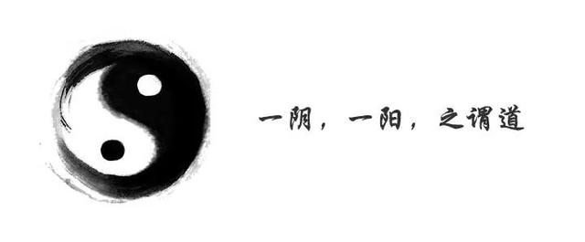

因此，如果我们能找到一件事情中，既对立、又统一的两面，我们就能用一条线，将他们彼此分开，组合成一个对立统一体，而他们两者也一定是MECE的。

比如，你们公司最近想招募新员工，应该采取什么样的招聘策略？

然后我们就开始思考，这张白纸上就是你所要面对的所有招募对象，是否可以用两分法，将他们分成一个对立统一的整体呢？

我们想到了一个要素：能力。

我们可以把他们先分成：能力强、能力弱的两类，彼此对立，结合在一起又是统一的整体，符合MECE。

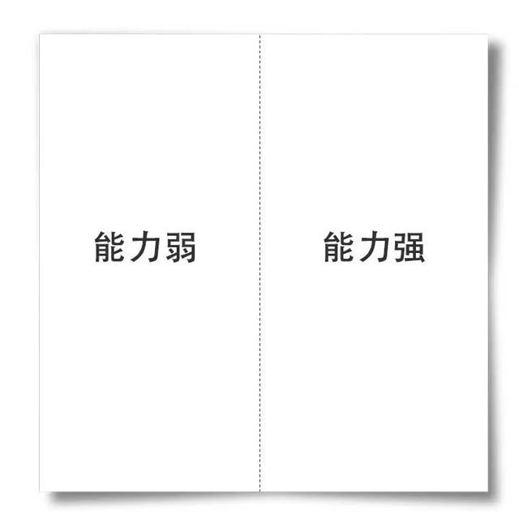

不过这个分类还是太宽泛，还有没有能组成对立统一体的其他要素？

我们又想到了第二个要素：态度。

我们可以把他们分成态度好、态度差这两类，彼此对立，又能融合统一。

可是，纸上已经被切割成能力强弱的两部分了，怎么办？

我们可以横向再画一条线，把纸切成上下两部分，上面的代表态度好，下面的代表态度差。

这样，纸张就被我们切成了一个二维四象限，4个部分彼此MECE，面试者也因此被我们分成了四类，他们分别是：

- 能力强/态度好
- 能力强/态度差
- 能力弱/态度差
- 能力弱/态度好

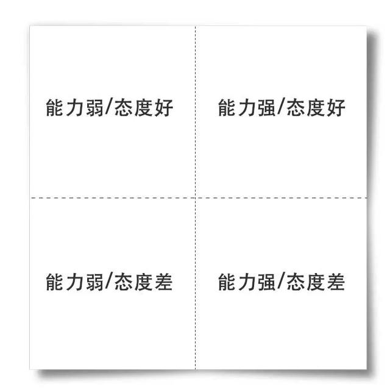

有了这个结构，我们就能很方便的制定出对应的招聘策略了：

注：结构化思考是帮助我们分析问题的，至于分析完之后又应该如何给出更有效的解决方案，还得看你的背景知识量，上面这个案例省略了具体策略的制定过程，有心的同学可以自行思考一下原因。

当然，遇到问题，你不用每次都自己切割。

有一些已经成熟的模型，也都是建立在这个切分方法之上的，你可以根据问题，直接拿现成的结构模型使用，不要自己重新发明轮子。

比如，基于两分法的管理理论：

比如，将两次两分法，组合成一个二维四象限的各种管理理论：

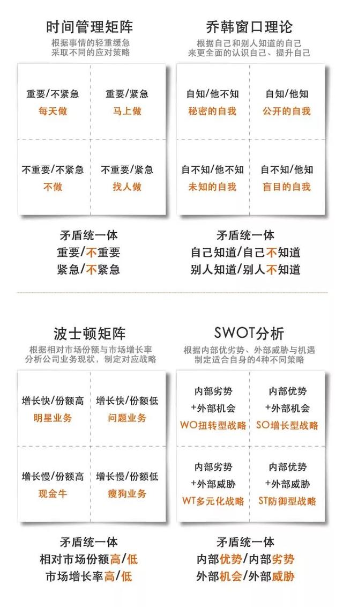

当然，还可以找到很多，就不一一列举了，他们都是基于MECE原则，使用了两分法切割出来的结构模型，非常好用。

学会了这个切割方法后，你自己也能原创出一些有价值的分析结构，说不定还能出本书啥的。

### 2第二个画线手法：三分法

三分法，就是在二分法的中间添加一个「过渡」的状态，让分类变的更加的细致，也避免非此即彼的绝对论断。比如：

- 黑、灰、白；
- 好、一般、差；
- 事前、事中、事后；
- 陌生客户、准客户、老客户；

你也能将两个三分法，组合成一个九宫格，比如：

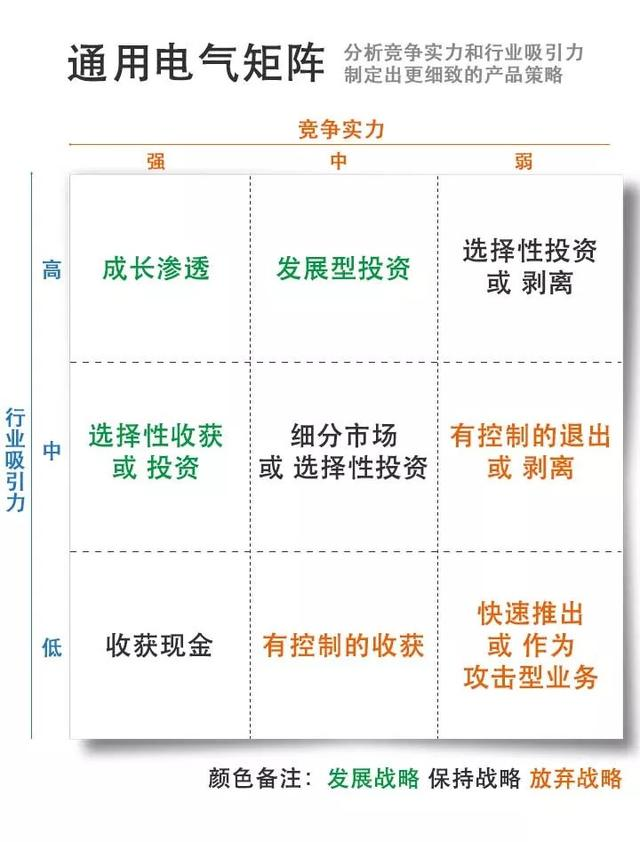

通用电气矩阵，就是把波士顿矩阵的二分法改成了三分法的变形，分析结构变得更加的细致，战略选择也更加的精准。

不过，三分法带来结构更细致的同时，也带来了结构的更加复杂，很多人看到这个九宫格就已经蒙圈了。因此，当你还没有熟练掌握结构化思维的前提下，如无必要，尽量避免过多的使用三分法。

结合这两种画线技巧，你可以设计出更复杂的结构模型。

比如，让你思维更缜密的「5W2H结构」。

比如，让你快速理清商业模式的「商业模式画布」

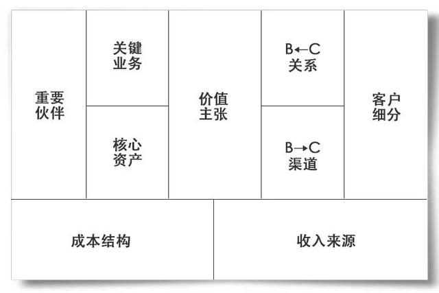

比如，让你能全面分析企业发展问题的「麦肯锡7S」

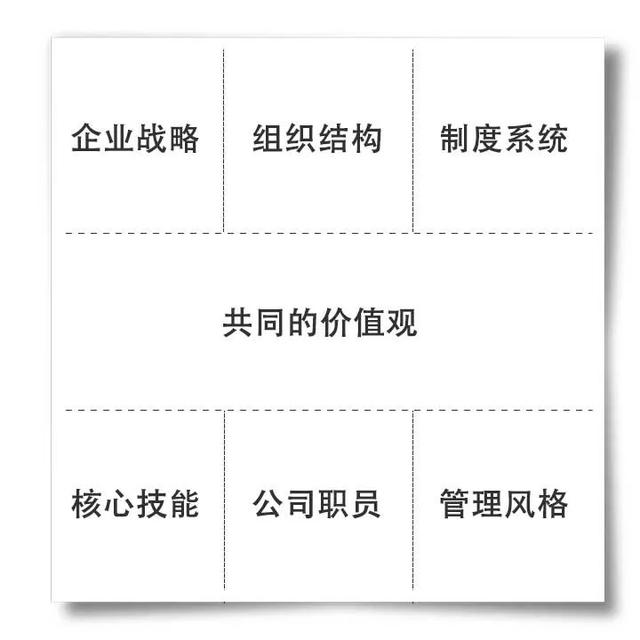

也许，你曾经看到过这些结构模型，也学习过他们的含义，以及使用方法。而通过刚才的学习，你是否能看到他们是如何被一步步切割出来的呢？

如果你能看到这些结构的演化过程，你是否对他们的理解和使用又更深了一个层次？

作为思考题，课后你可以自己试着拿张纸推演一遍

回到前面头脑风暴的案例

我们试着用平面切割法，看看可以把刚才这个问题切成什么样的结构：

问题：如何在未来三个月完成100万销售业绩？

1用两分法，找到第一条切割线

客户？产品？活动方案？营销？渠道？

好像这些都不太适合，要么范围太小，无法包含所有相关的信息；要么无法切分成一个对立统一的整体。

那应该怎么切？

通过思考后发现，要完成100万销售业绩，无论是从哪个角度思考，无非就分为公司的外部因素和公司的内部因素，这既包含了所有的相关要素，又对立统一。

因此，我们第一条线可以先把结构分为「内部因素、外部因素」这两部分。

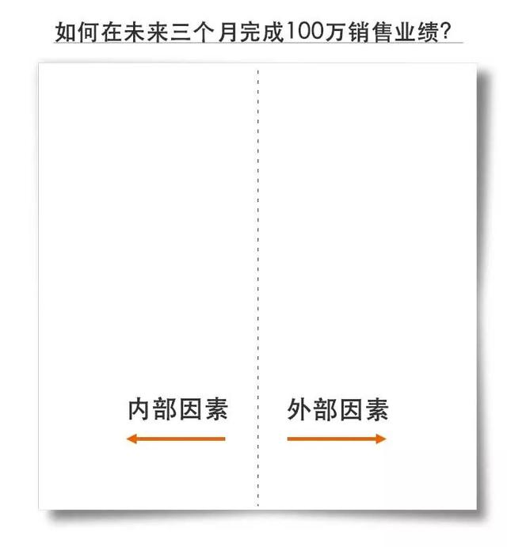

继续用两分法、三分法切割结构。

2第二条线怎么画？

要完成100万销售，无非就2个环节：

- 把产品生产出来；
- 把产品卖掉；

因此，第二条线可以是「生产与销售」这对对立统一体。

切割后，出现了一个二维四象限，彼此符合MECE原则。为了便于理解，我们对这4部分进行重新命名：

- 外部销售问题：那就是「营销渠道」的问题
- 外部生产问题：那就是「市场需求」的问题
- 内部销售问题：那就是「销售团队」的问题
- 内部生产问题：那就是「产品设计与供应链」的问题

3然后，再看一下每个部分是否还可以继续切割：

比如，在「营销渠道」这个分类中，不同的用户类别适用于不同的渠道和营销方式，因此，可以用三分法，切成：新客户、准客户、老客户三类；再横向切成营销和渠道两部分；

比如，在「销售团队」这个分类中，使用X-Y结构，设置业绩目标，施加外部压力；设置业务奖励，提供内在激励；

比如，在「市场需求」这个分类中，用两分法，切分为用户需求和市场热点，用于搜集信息，协助设计部门做出更受欢迎的产品或者活动；

比如，在「产品设计/供应」这个分类中，用两分法，切分为产品设计和供应链管理，针对用户的需求和未来这3个月可能出现的销售高峰，调整产品设计，对供应链进行优化等…

如果说，前面金字塔结构是一名业务主管的视角，那么当你通过平面切割，你便拥有了CEO的全局视野。

除了看到前面金字塔结构中的所有和营销相关的内容，你还能看到之前未考虑到的公司内部视角和产品生产视角：

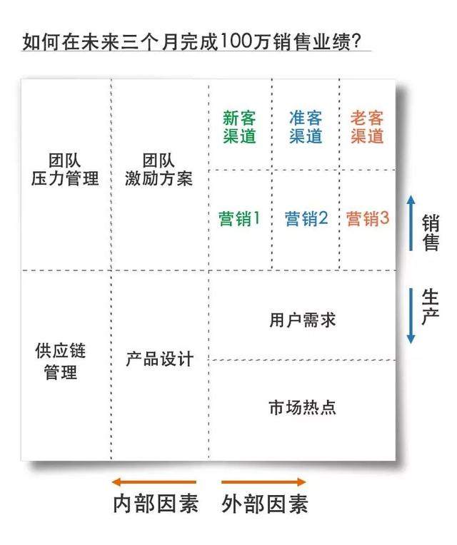

有了这个结构，你就可以从用户需求、市场热点的部分开始，收集相关信息并加以分析；

然后，用这些信息指导你的产品设计，活动设置，优化产品供应链；

接着，设定销售团队的业绩目标，制定团队的激励方案；

最后，针对不同用户的不同销售渠道，采取不同的营销方式。

通过平面切割来进行结构化思维，你的整个解决方案，将变得更加的完整和系统！

还没结束...

当方案开始执行，根据实际的销售情况，市场反馈，视图中右下角的「市场需求」部分的信息就会被更新；

这将进一步帮助你优化产品设计，提供更受市场欢迎的产品，优化供应链的管理，以满足市场的增长；

紧接着，调整团队业绩目标，优化激励方案；

然后，继续改善渠道的营销方式…

随后，又进入下一波优化循环，如此往复...

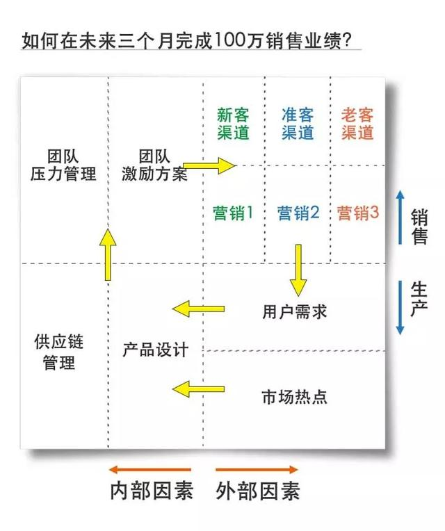

你有没有发现，整个方案动起来了！

它不再是固定的方案，在纸上一成不变，而是会随着时间推移，不断调整、自我演化的！这种加入了时间轴的动态思考，将我们的思维从三维上升到了四维，进化到了另一种方式...

> **来源**
> [《思维混乱，是因为大脑没有结构》](https://www.toutiao.com/i6619057728725729800/)
